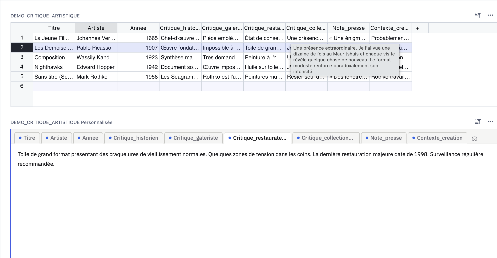
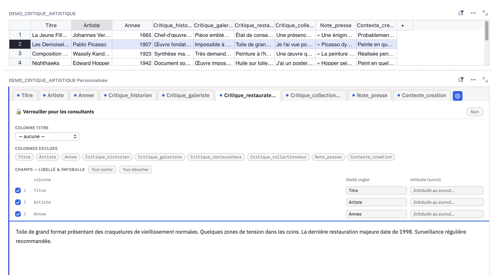

# grist-widget-multifield-viewer

> Grist custom widget — multi-field text viewer with tabs, configurable labels, native column description tooltips, lock mode for read-only users, and Grist column renaming.  
> Visionneur de champs texte avec onglets, libellés personnalisables, infobulles natives, mode verrouillage et renommage des colonnes Grist.

---

## 🇫🇷 Français

### Présentation

Widget personnalisé pour [Grist](https://www.getgrist.com/) qui affiche les champs texte d'un enregistrement sélectionné dans une interface à onglets compacte.

Conçu pour des tables contenant plusieurs champs texte longs — avis de spécialistes, commentaires multiples, notes structurées — et pour s'intégrer dans une page multi-vues : la sélection d'une ligne dans la table principale actualise automatiquement le widget.

### Fonctionnalités

* **Vue en onglets** — un onglet par champ, point coloré selon présence de contenu, texte complet dans le panneau
* **Colonnes dynamiques** — détectées automatiquement depuis l'enregistrement, aucune colonne codée en dur
* **Infobulles au survol** — alimentées automatiquement depuis les **descriptions natives des colonnes Grist** (panneau colonne → Description), surchargeables manuellement
* **Renommage synchronisé** — double-clic sur un onglet pour renommer : met à jour le libellé widget ET le label Grist simultanément
* **Mode verrouillage 🔒** — masque les réglages pour les consultants ; les éditeurs gardent accès via ⋯ → Options du widget
* **Colonnes exclues** — masquer des colonnes du widget en un clic, réintégrables à tout moment
* **Réordonnancement** — glisser-déposer pour changer l'ordre des onglets
* **Colonne titre** — choisir la colonne affichée dans la barre (ex. nom de la personne)
* **Options persistées dans `localStorage`** — aucune barre "Enregistrer" Grist, configuration isolée par table
* **Bilingue** — détection automatique FR / EN selon `navigator.language`
* **Accessible** — rôles ARIA, navigation clavier, focus visible

### Infobulles et descriptions de colonnes

Le widget lit automatiquement les descriptions natives via `_grist_Tables_column`. Si une colonne possède une description (renseignée dans **Panneau colonne → Description**), elle est automatiquement utilisée comme infobulle au survol de l'onglet.

Tu peux surcharger cette description dans le panneau ⚙️ — la valeur personnalisée prend le dessus et ne sera plus écrasée.

### Renommage des colonnes

Double-clic sur un onglet → édition inline. Au blur ou à la validation (`Enter`) :
- le libellé affiché dans l'onglet est mis à jour
- le label de la colonne dans Grist est mis à jour via `_grist_Tables_column`

Le `colId` (identifiant interne) reste inchangé — les formules et références ne cassent pas.

### Mode verrouillage

Active le verrou 🔒 dans le panneau ⚙️ pour griser et désactiver le bouton de configuration pour les utilisateurs en lecture seule. Les éditeurs du document conservent toujours l'accès via **⋯ → Options du widget**.

### Installation

1. Dans ta page Grist, ajouter une vue → **Widget personnalisé**
2. Renseigner l'URL :  
   `https://maximelacoste.github.io/grist-widget-multifield-viewer/widget_multifield_viewer.html`
3. Sélectionner l'accès **"Complet"** (nécessaire pour le renommage de colonnes)
4. Lier le widget à ta table principale via **"Données de"**

### Configuration

Clique sur l'icône ⚙️ dans la barre d'onglets (ou via ⋯ → Options du widget) :

| Option | Description |
|---|---|
| **🔒 Verrouiller** | Grise ⚙️ pour les consultants |
| **Colonne titre** | Colonne affichée dans la barre (ex. Nom, Titre) |
| **Colonnes exclues** | Clic pour exclure / réintégrer une colonne |
| **Libellé** | Renomme l'onglet ET le label Grist (au blur) |
| **Infobulle** | Texte au survol (pré-rempli depuis la description Grist) |
| **Tout cocher / décocher** | Afficher ou masquer tous les champs en un clic |
| **⠿ Glisser-déposer** | Réordonner les onglets |

---

## 🇬🇧 English

### Overview

A Grist custom widget that displays text fields from a selected record in a compact tabbed interface.

Designed for tables with multiple long text fields — specialist opinions, structured notes, multiple comments — and for multi-view pages: selecting a row in the main table automatically updates the widget.

### Features

* **Tabs view** — one tab per field, colored dot indicating content presence, full text in the panel
* **Dynamic columns** — auto-detected from the record, no hardcoded column names
* **Hover tooltips** — auto-populated from **native Grist column descriptions** (column panel → Description), manually overridable
* **Synchronized renaming** — double-click a tab to rename inline: updates both the widget label and the Grist column label simultaneously
* **Lock mode 🔒** — grays out the ⚙️ button for read-only users; editors keep access via ⋯ → Widget options
* **Excluded columns** — hide columns from the widget in one click, re-includable at any time
* **Reordering** — drag and drop to change tab order
* **Title column** — choose which column is displayed in the tab bar
* **localStorage persistence** — no Grist "Save layout" bar triggered on config changes, config scoped per table
* **Bilingual** — automatic FR / EN detection via `navigator.language`
* **Accessible** — ARIA roles, keyboard navigation, visible focus

### Setup

1. In your Grist page, add a view → **Custom Widget**
2. Enter the URL:  
   `https://maximelacoste.github.io/grist-widget-multifield-viewer/widget_multifield_viewer.html`
3. Select access level **"Full"** (required for column renaming)
4. Link the widget to your main table via **"Data from"**

### Configuration

Click the ⚙️ icon in the tab bar (or via ⋯ → Widget options):

| Option | Description |
|---|---|
| **🔒 Lock** | Grays out ⚙️ for read-only users |
| **Title column** | Column displayed in the bar (e.g. Name, Title) |
| **Excluded columns** | Click to exclude / re-include a column |
| **Label** | Renames the tab AND the Grist column label (on blur) |
| **Tooltip** | Hover text (pre-filled with native Grist description) |
| **Check all / Uncheck all** | Show or hide all fields at once |
| **⠿ Drag & drop** | Reorder tabs |

### Technical notes

- Column descriptions are read from `_grist_Tables_column` on first record load
- Column renaming uses `applyUserActions` → `UpdateRecord` on `_grist_Tables_column` (label field only — `colId` is never modified)
- Config stored in `localStorage` with key `grist_mfv_<tableId>`

---

## Fichiers / Files

| Fichier | Description |
|---|---|
| `widget_multifield_viewer.html` | Widget principal / Main widget file |
| `screenshot-tabs.png` | Capture vue onglets / Tabs view screenshot |
| `screenshot-settings.png` | Capture panneau réglages / Settings panel screenshot |
| `demo_critique_artistique.csv` | Table de démonstration / Demo table |

---

## Licence

MIT
